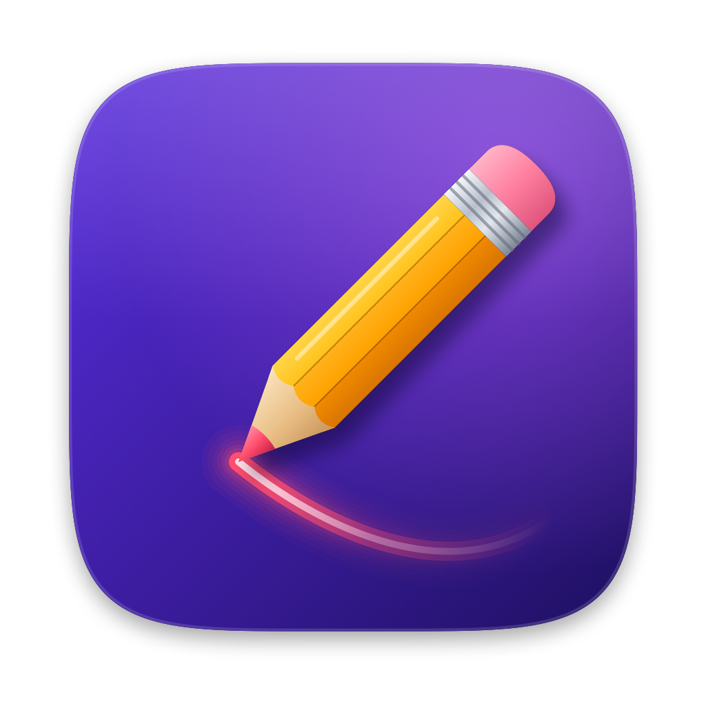

<p align="center">
  
</p>

<h1 align="center">Pencil</h1>

<p align="center">
  Draw on top of anything on your screen, snapshot it with the drawing, and paste it into Claude Code.<br>
  A small native macOS app (Swift + AppKit, macOS 14+).
</p>

---

## 📑 Contents

- [🚀 Install](#-install)
- [🔐 Permissions](#-permissions)
- [🩹 Troubleshooting](#-troubleshooting)
- [⌨️ Cheat sheet](#️-cheat-sheet)
- [✏️ Drawing](#️-drawing)
- [📸 Snapshots](#-snapshots)
- [🎥 Screen recording](#-screen-recording)
- [📋 Clipboard history](#-clipboard-history)
- [🧭 Toolbar and menu bar](#-toolbar-and-menu-bar)
- [🛑 Quitting and login](#-quitting-and-login)
- [🛠️ Development](#️-development)

---

## 🚀 Install

### On the Mac you build on

You need Xcode or the Xcode Command Line Tools (`xcode-select --install`).

```sh
git clone git@github.com:troubledjoker/pencil.git
cd pencil

scripts/make-signing-identity.sh    # once per Mac: keeps the permission working across rebuilds
scripts/bundle.sh                   # builds and signs build/Pencil.app

cp -R build/Pencil.app /Applications/
open /Applications/Pencil.app
```

Then do the one-time [Screen Recording permission](#-permissions). That's it.

> [!TIP]
> Skipping `make-signing-identity.sh` still works, but every rebuild gets a new signature
> and macOS asks for the permission again.

### On another Mac (copying the app)

1. Copy `Pencil.app` to the other Mac (AirDrop, USB, zip).
2. Drag it into **/Applications**.
3. Open it **from /Applications**. The first time, right-click → **Open** → **Open**
   (it isn't notarized, so a plain double-click gets blocked).
4. Do the [Screen Recording permission](#-permissions).

> [!IMPORTANT]
> Don't run Pencil straight from Downloads or the AirDrop folder. macOS runs it from a
> hidden temporary copy and the permission **never sticks**. Pencil warns you when this
> happens.

### Updating

Quit Pencil (⌥Q), `git pull`, run `scripts/bundle.sh`, copy it to /Applications again, open it.

---

## 🔐 Permissions

### Screen Recording (required for snapshots and recordings)

1. Take a snapshot (**⌥3**). macOS asks for permission.
2. Open **System Settings → Privacy & Security → Screen Recording**
   (or Pencil's menu bar icon → **Open Screen Recording settings**).
3. Turn **Pencil** on.
4. Pencil menu → **Relaunch Pencil**. macOS only applies the permission after a relaunch.

### Accessibility (optional)

Only needed for **⌥⇧V**, which pastes a burst one image at a time.
**System Settings → Privacy & Security → Accessibility → Pencil**
(or the menu's **Open Accessibility settings**).

---

## 🩹 Troubleshooting

| Problem | Fix |
| --- | --- |
| 🔴 **Pencil is switched on in Screen Recording but still says "Allow Pencil"** | The switch belongs to an older build, and toggling it doesn't fix that. Pencil menu → **Reset Screen Recording permission**, switch Pencil on in the list that opens, then **Relaunch Pencil**. |
| 🔴 **Toast says "Move Pencil to Applications"** | It's running from Downloads or AirDrop. Move it to /Applications and open it from there. If that still doesn't work: `xattr -dr com.apple.quarantine /Applications/Pencil.app` |
| ⚠️ **Permission gone after every rebuild** | Run `scripts/make-signing-identity.sh` once, then `scripts/bundle.sh` again. |
| ⚠️ **"Pencil can't be opened" on first launch** | Right-click the app → **Open** → **Open**. |
| ⚠️ **A shortcut does nothing** | Another app or a macOS shortcut owns it. Pencil tells you which one, once, in a toast. |

Still stuck? This shows what Pencil logged about the permission:

```sh
log show --last 5m --predicate 'process == "Pencil"' | grep "Screen Recording"
```

The manual reset, same as the menu item: `tccutil reset ScreenCapture com.haim.pencil`

---

## ⌨️ Cheat sheet

Every global key works from any app, even with the toolbar collapsed.

#### ✏️ Draw

| Key | Action |
| --- | --- |
| **⌥1** | Laser (press again to turn off) |
| **⌥2** | Pen (press again to turn off) |
| **⌥7** | Highlighter (press again to turn off) |
| **⌥0** | Off: stop drawing and hide the ink |
| **⌥]** / **⌥[** | Bigger / smaller stroke |
| **⌥Z** | Undo |
| **⌥X** | Clear all ink |

#### 📸 Capture

| Key | Action |
| --- | --- |
| **⌥3** | Snapshot the screen under the mouse (ink included) |
| **⌥4** | Capture a region |
| **⇧⌥4** | Burst: several regions in a row, Esc when done |
| **⌥6** | Capture the drawing, cropped to the ink |
| **⌥5** | Start / stop screen recording |

#### 📋 Clipboard and app

| Key | Action |
| --- | --- |
| **⌃⌘V** | Clipboard history |
| **⌥⇧V** | Paste the last burst one image at a time |
| **⌥9** | Open / close the toolbar |
| **⌥/** | Show shortcuts on screen |
| **⌥Q** | Quit Pencil (asks first) |

#### 🎨 While drawing (no modifier needed)

| Key | Action |
| --- | --- |
| **P** / **H** / **L** | Pen / Highlighter / Laser |
| **1–5** | Red, yellow, green, blue, white |
| **Z** or **⌘Z** | Undo |
| **X** | Clear all |
| **]** / **[** | Bigger / smaller stroke |
| **⏎** | Capture the drawing to the clipboard |
| **S** / **A** | Snapshot screen / Capture region |
| **Esc** | Stop drawing. Ink stays and clicks go through |
| **?** | Show the cheat sheet |

> [!NOTE]
> While Pencil runs, ⌥Z, ⌥X, ⌥/, ⌥] and ⌥[ no longer type Ω, ≈, ÷, ‘ and “.
> If a key is also a macOS shortcut (for example a Screenshots shortcut remapped to ⌥4),
> Pencil leaves it to macOS and tells you. Change the macOS one to get Pencil's back.

---

## ✏️ Drawing

| Mode | What it does |
| --- | --- |
| **Pen** | Solid strokes that stay until cleared |
| **Highlighter** | Thick, see-through strokes that stay until cleared |
| **Laser** | Glowing stroke that fades after about 2.5s |
| **Pass-through** | Ink stays visible, clicks go to your apps (press **Esc** while drawing) |
| **Off** | Ink hidden, clicks go to your apps. The ink comes back when you draw again |

- **Colors:** keys **1–5**, or the color chip in the toolbar.
- **Stroke size:** 7 sizes shared by every tool and remembered. Use **⌥]** / **⌥[**, the
  **+ / −** in the floating pill, or scroll over the size dot. Ink you already drew keeps its width.
- **Undo / Clear:** a small pill shows up next to the pencil whenever there's ink on screen.
- Starting a mode with ⌥1 or ⌥2 takes the keyboard right away. **Esc** hands it back to your app.

---

## 📸 Snapshots

| How | What you get |
| --- | --- |
| **⌥3** | The whole screen under the mouse |
| **⌥4** | Drag an area; it's captured when you let go. Esc cancels |
| **⌥6** or **⏎** while drawing | Just the drawing, with some room around it (the whole screen if there's no ink) |
| **⇧⌥4** | Burst: drag, drag, drag, then **Esc** |

Every snapshot is:

- 💾 saved to `~/Pictures/Pencil/pencil-YYYYMMDD-HHmmss.png`
- 📋 copied to the clipboard, with a "Copied" toast
- 🖊️ taken with your ink in it and Pencil's own toolbar left out

### Pasting it

- **Claude Code:** press **Ctrl+V** in the prompt (Ctrl, not ⌘).
- **Finder, Slack, Mail, browsers, editors:** **⌘V**.
- **Terminals:** with **Paste images as file paths in terminals** on (in the menu), ⌘V pastes
  the file's path.

### Bursts

One message that needs several screenshots:

1. **⇧⌥4**, then drag out each area. A pill keeps count ("Burst · 3 captured").
2. **Esc** when done.
3. **⌘V** pastes them all at once in Finder, Slack and Mail. For apps that take one image
   per paste (Claude Code, many chat apps), press **⌥⇧V** instead
   (needs [Accessibility](#accessibility-optional)).

---

## 🎥 Screen recording

> Needs macOS 15 and the same Screen Recording permission.

1. Press **⌥5** (or the record button).
2. Drag out an area, or press **Space** for the whole screen. Esc cancels.
3. Record. You can keep drawing, and the ink and cursor show up in the video.
4. Press **⌥5** again or click **Stop**. It stops on its own after 5 minutes.

The video is saved as `~/Pictures/Pencil/pencil-rec-YYYYMMDD-HHmmss.mp4` (H.264, 30fps,
no audio) and copied to the clipboard as a file.

---

## 📋 Clipboard history

Everything you copy, including every Pencil capture, is kept.

- Open it with **⌃⌘V**, the toolbar's **Clipboard** button, or the menu.
- **Click** a row to copy it again, or **drag** it into another app.
- **Search** finds text, file names, and text inside screenshots.
- Copies from password managers are never saved.

Full details: [docs/CLIPBOARD.md](docs/CLIPBOARD.md)

---

## 🧭 Toolbar and menu bar

Pencil has no Dock icon. It lives in a **pencil tab on the left edge of the screen**.

- **Hover** the tab and it slides out. **Click** it to open the toolbar.
- **Drag** it up or down, or onto another display. It remembers where you left it.
- **Hover** any button to see its name and shortcut.
- The toolbar never takes focus from the app you're working in.

<details>
<summary><b>What's in the toolbar</b></summary>

- **Draw:** Pen, Highlighter, Laser, and the color chip (click it for the five colors)
- **Capture:** Snapshot, Capture region, Capture drawing, Screen recording
- **Clipboard:** the clipboard history sidebar
- **Off:** stop drawing and collapse
- **Hide** and **Quit** at the end

The toolbar opens downward, or upward when the tab is near the bottom of the screen. It
stays open while you draw, so you can change color mid-drawing. The pencil tab gets a
ring in the ink color while you're drawing and a red dot while recording.

</details>

<details>
<summary><b>What's in the menu bar menu</b></summary>

The menu bar icon is a small fallback. It shows the current mode and has the drawing
modes, every capture, **Keyboard shortcuts…**, the permission helpers (**Open Screen
Recording settings**, **Reset Screen Recording permission**, **Relaunch Pencil**,
**Open Accessibility settings**), **Start at login**, **Open snapshots folder**, and **Quit**.

</details>

---

## 🛑 Quitting and login

- **Quit:** **⌥Q**, the toolbar's **Quit** button, or menu bar icon → **Quit Pencil**.
  Pencil asks first: **Return** quits, **Esc** keeps it running.
  - Your drawing is cleared. Clipboard history and captures are kept.
  - A running recording is stopped and saved first.
  - From a terminal: `pkill -x Pencil` (doesn't ask).
- **Starts at login** by default. To turn it off, uncheck **Start at login** in the menu bar
  menu, or use System Settings → General → Login Items.
- **Start it again:** `open /Applications/Pencil.app`, or find Pencil in Spotlight.

---

## 🛠️ Development

```sh
scripts/bundle.sh     # icon + release build + signed build/Pencil.app
swift test            # stroke model, laser fade, dock geometry, capture, shortcuts
```

- The icon is drawn in code (`Sources/PencilCore/IconArt.swift`). `scripts/make-icon.sh`
  renders it to `Resources/AppIcon.icns` and `Resources/icon-preview.png`, and
  `bundle.sh` runs it on every build.
- The bundle id is `com.haim.pencil`. Builds are signed with the local "Pencil Local
  Signing" identity when it exists, and ad-hoc otherwise.
